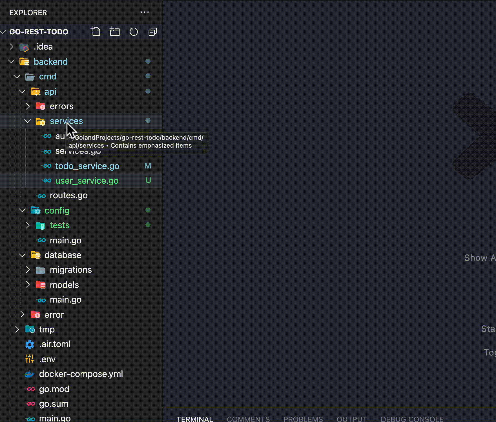

# vscode-open-files-in-directory 

A vscode extension to open a directory-load of files. 

## Features

This extension adds the option to the file explorer (and the command options, accessed with ctrl + shift + p, or cmd + shift + p on mac), to open all the files in the directory. If the selected item is a file it selects the parent directory, if its a directory it'll use that directory.

## Installation
Install within vscode by pressing `cmd + shift + p` and searching for extensions and searching for `vscode-open-files-in-directory`.
Or, search the [releases in this repository](https://github.com/kieran-osgood/vscode-open-files-in-directory/releases), download the vsix file, and install by running `ext install kieran-osgood.vscode-open-files-in-directory`

## Extension Settings

| Name                                               | Description                                    | Default Value           |
| -------------------------------------------------- | ---------------------------------------------- | ----------------------- |
| `vscode-open-files-in-directory.maxFiles`          | Maximum number of files to open in one action: |         `10`            |
| `vscode-open-files-in-directory.maxRecursiveDepth` | Maximum depth to traverse through subfolders:  |          `1`            |
## Known Issues

None currently 👀

## Release Notes

See [Changelog.md](https://github.com/kieran-osgood/vscode-open-files-in-directory/blob/main/CHANGELOG.md)

## LICENSE

MIT

**Enjoy!**
